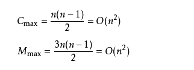

### 冒泡排序 (Bubble Sort)

#### 原理：

比较两个相邻的元素，将值大的元素交换至右端。

#### 思路：

1. 依次比较相邻的两个数，将小数放在前面，大数放在后面。
2. 即在第一趟：首先比较第1个和第2个数，将小数放前，大数放后。然后比较第2个数和第3个数，将小数放前，大数放后，如此继续，直至比较最后两个数，将小数放前，大数放后。
3. 重复第一趟步骤，直至全部排序完成。

#### 优点：

每进行一趟排序，就会少比较一次，因为每进行一趟排序都会找出一个较大值。如上例：第一趟比较之后，排在最后的一个数一定是最大的一个数，第二趟排序的时候，只需要比较除了最后一个数以外的其他的数，同样也能找出一个最大的数排在参与第二趟比较的数后面，第三趟比较的时候，只需要比较除了最后两个数以外的其他的数，以此类推……也就是说，没进行一趟比较，每一趟少比较一次，一定程度上减少了算法的量。

#### 时间复杂度：

1. 如果我们的数据正序，只需要走一趟即可完成排序。所需的比较次数C和记录移动次数M均达到最小值，即：Cmin=n-1;Mmin=0;所以，冒泡排序最好的时间复杂度为O(n)。
2. 如果很不幸我们的数据是反序的，则需要进行n-1趟排序。每趟排序要进行n-i次比较(1≤i≤n-1)，且每次比较都必须移动记录三次来达到交换记录位置。在这种情况下，比较和移动次数均达到最大值： 冒泡排序的最坏时间复杂度为：O(n2) 。
3. 综上所述：冒泡排序总
